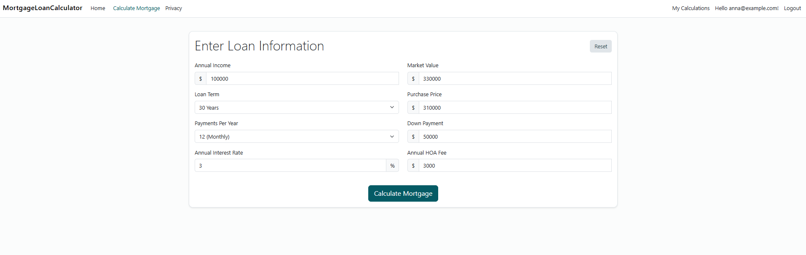
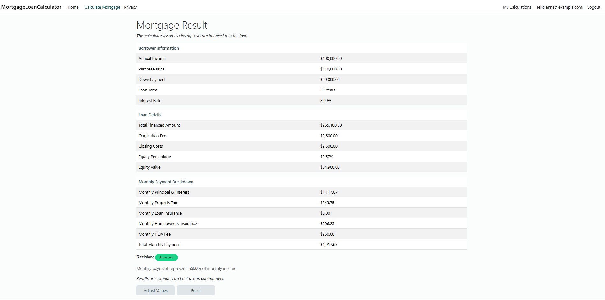
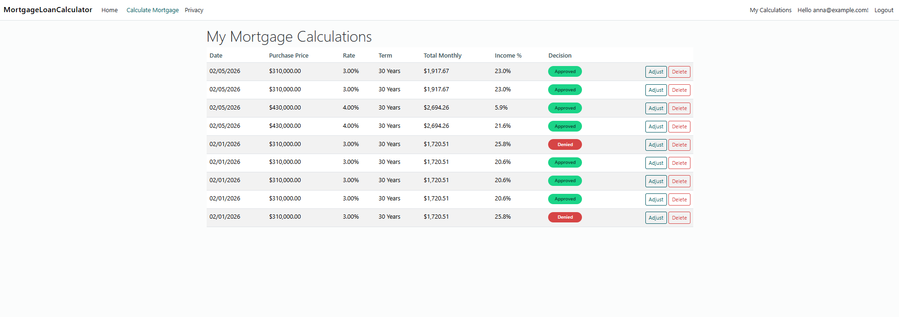

# Mortgage Calculator Web Application

A mortgage loan calculator web application built with C# and ASP.NET Core MVC. This application allows users to calculate monthly mortgage payments, evaluate loan eligibility, and save calculation results for later review and adjustment.

## Project Status

This project is under active development as part of a Computer Science capstone at Southern New Hampshire University.

The application originated as a console-based mortgage calculator developed during the Microsoft Software and Systems Academy (MSSA) and has been refactored into a full ASP.NET Core MVC web application. Enhancements focus on professional architecture, database persistence, and user-focused functionality.

## Features

- **Mortgage Payment Calculator**: Calculate monthly mortgage payments including principal and interest
- **Loan Eligibility Assessment**: Determine if the borrower qualifies based on income-to-payment ratio
- **Comprehensive Fee Calculation**: Includes:
  - Origination fees
  - Closing costs
  - Property tax
  - Homeowners insurance
  - HOA fees
  - Private Mortgage Insurance (PMI) when applicable
- **Multiple Loan Configurations**: Configurable loan terms; flexible payment schedules
- **User Accounts and History**: Authentication via ASP.NET Core Identity; persistent storage of calculation snapshots; ability to review, adjust, or delete previous calculations
- **Clean, Responsive UI**: MVC-based views; Bootstrap-based styling with custom theming

## Technology Stack

- **Framework**: ASP.NET Core MVC
- **.NET Version**: .NET 10
- **Database**: SQL Server with Entity Framework Core
- **Authentication**: ASP.NET Core Identity
- **Architecture**: Clean architecture with separate domain layer

## Project Structure

MortgageLoanCalculator/
- MortgageLoanCalculator/
  - Controllers/
    - HomeController.cs
    - LoanController.cs
  - Data/
    - ApplicationDbContext.cs
  - Models/
    - MortgageCalculationSnapshot.cs
    - MortgageResultViewModel.cs
    - MortgageCalculationListItemViewModel.cs
  - Views/
    - Home/
    - Loan/
    - Shared/
  - Program.cs

- MortgageLoanCalculator.Domain/
  - Loan.cs
  - LoanCalculator.cs
  - LoanDecisionService.cs
  - MortgageCalculatorConstants.cs

## Getting Started

### Prerequisites

- [.NET 10 SDK](https://dotnet.microsoft.com/download/dotnet/10.0) or later
- A code editor (Visual Studio 2025, Visual Studio Code, or Rider)
- SQL Server (local or Azure)

### Installation

1. Clone the repository:
```bash
git clone https://github.com/padgettanna/Mortgage-Calculator-Web.git
cd Mortgage-Calculator-Web
```

2. Restore dependencies:
```bash
dotnet restore
```

3. Apply database migrations:
```bash
dotnet ef database update
```

4. Run the application:
```bash
cd MortgageLoanCalculator
dotnet run
```

5. Open your browser and navigate to `https://localhost:5001` or the URL shown in the terminal

## Usage

1. **Create an Account or Sign In**
2. **Enter Loan and Borrower Information**
   - Annual income
   - Purchase price and down payment
   - Interest rate and loan term
   - Annual HOA fees (if applicable)

3. **Calculate Mortgage**
   - View monthly payment details
   - Review payment-to-income ratio and eligibility decision

4. **Save and Review**
   - Saved calculations appear in the user’s history
   - Adjust inputs or delete previous calculations as needed

## Key Components

### LoanCalculator
Encapsulates mortgage calculation logic, including:
- Loan amount and fees
- Monthly principal and interest
- PMI calculations
- Total monthly cost modeling

### LoanDecisionService
Evaluates loan eligibility based on payment-to-income ratio thresholds

### MortgageCalculationSnapshot
Represents a persisted snapshot of a user’s mortgage calculation, enabling historical review and comparison

## Author

Anna Padgett

## Notes

This project is intended for educational purposes and demonstrates modern ASP.NET Core development practices, including MVC architecture, Entity Framework Core, authentication, and database integration

## Screenshots

### Mortgage Input Form


### Calculation Results


### Saved Calculation History

